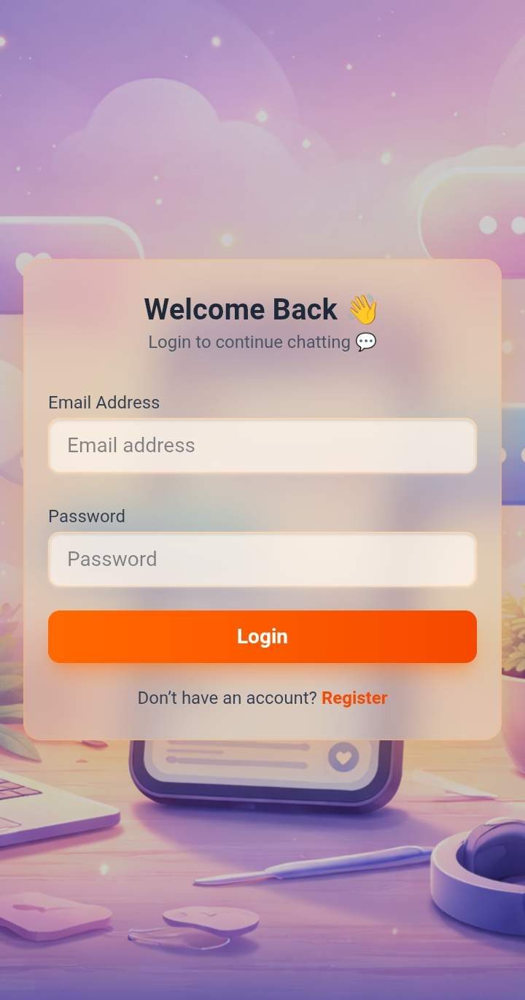
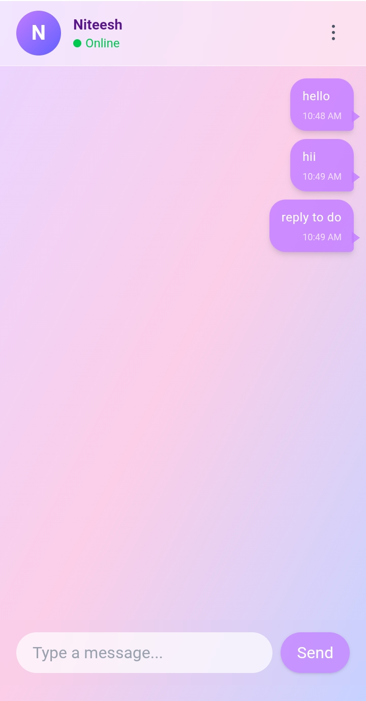
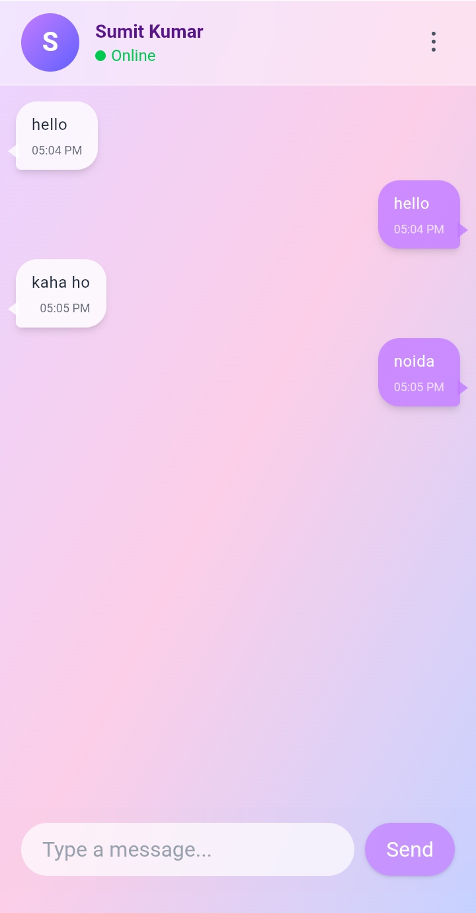
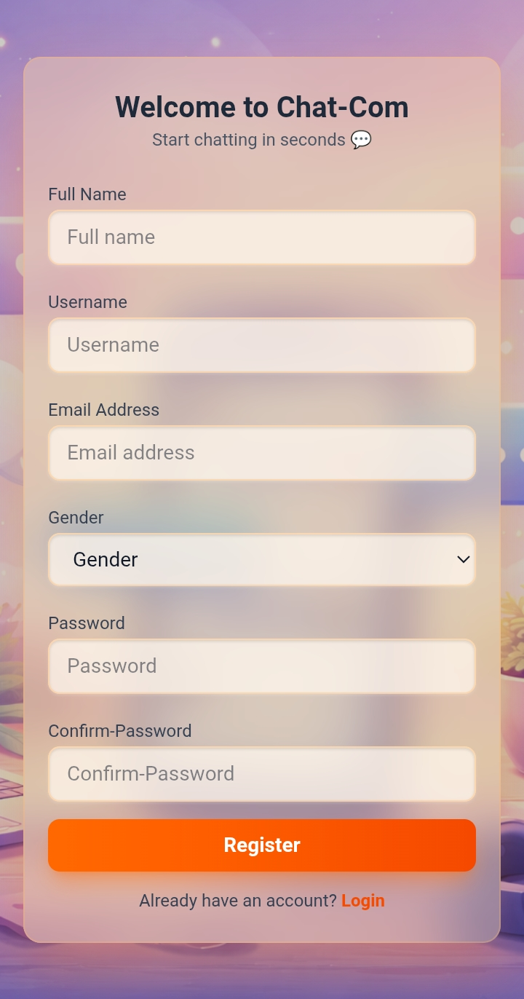

# 💬 Chat-Com — Real-Time Chat Application

A modern **full-stack real-time chat application** built with React, Node.js, Express, and Socket.io.  
Users can chat instantly, see online users, and enjoy a smooth responsive UI.

---

## 🚀 Live Demo
👉 [https://chat-app-htcu.onrender.com/]

---

## ✨ Features

- 🔐 User Authentication (JWT + Cookies)
- 💬 Real-Time Messaging (Socket.io)
- 🟢 Online/Offline Status
- 🔍 User Search
- 📱 Fully Responsive UI (Mobile + Desktop)
- 🧠 State Management (Zustand)
- 🖼️ Auto-generated Avatars
- 💾 Message Persistence (MongoDB)

---

## 🛠️ Tech Stack

### Frontend
- React 19
- Vite
- Tailwind CSS + DaisyUI
- Zustand
- Socket.io Client
- React Router
- Axios

### Backend
- Node.js
- Express.js
- MongoDB + Mongoose
- Socket.io
- JWT Authentication
- bcryptjs

---

## 📸 Screenshots

### 📱 Mobile View

<p align="center">
  
  
  
</p>

<p align="center">
  
  
</p>

---

## ⚙️ Installation

### 1️⃣ Clone Repo
```bash
git clone https://github.com/your-username/chat-com.git
cd chat-com